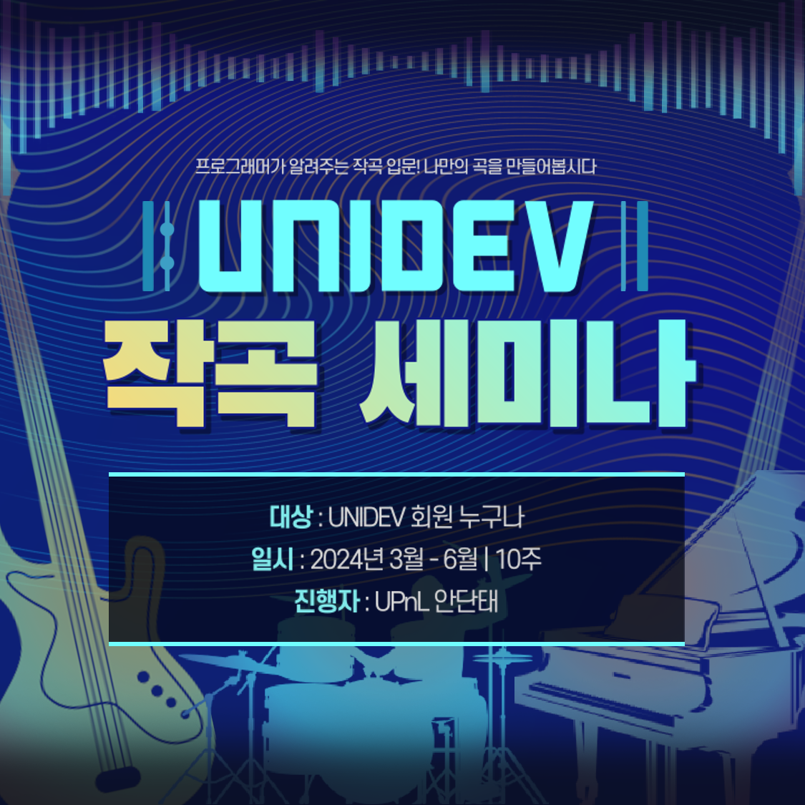

# UNIDEV 작곡 세미나 2024

> 작곡에 관심이 많지만 어떻게 할지 막막한 분들을 위해 준비했습니다.  
> 프로그래머가 알려주는 작곡 입문! 나만의 곡을 만들어봅시다!

## 개요

### 세미나 정보
* 🧑‍🎓 대상: UNIDEV 소속 동아리 회원 누구나
* 📅 일시: 2024년 3월 ~ 8월 (11주)
  * 매주 금요일 오후 7:30 ~ 10:30 (최대 3시간)
* 🏫 장소: 서울대학교 301동 203호 (오프라인 + 온라인)
* 🧑‍🏫 진행자: UPnL 안단태 (Andantino; [@salt26](https://github.com/salt26))
* 🚥 진행 방법
  * 오프라인 참석 가능 인원이 10명 이상이면서 3개 동아리 이상이면 출발
  * 오프라인 참석을 원칙으로 하되, 서울 소재 동아리가 아닌 경우 온라인 참석 허용
  * 매주 이론 + 실습의 형태로 진행
  * 시험 기간 등 참석자가 적은 기간에는 휴강
* 🪙 참가비: 무료
* 🎯 목표
  * 🎛️ 작곡 프로그램(NWC, MuseScore, FluidSynth, Audacity 등)을 다룰 수 있게 됨
  * 🎵 음악의 이론(음계, 조성, 화음 등)을 학습함
  * 🪄 작곡을 직접 해봄
  * 👩‍💻 음악을 컴퓨터로 분석할 수 있게 됨
  * 😄 UNIDEV 소속 동아리 회원들과 교류하고 친목을 쌓음
* 🎒 준비물
  * 💻 Windows 노트북 (macOS도 실습 가능)
  * 🎼 악보를 보고 어떤 음인지 알 수 있음

### 커리큘럼
> 이론 ➡️ 실습의 형태로 진행합니다. 시험기간에는 쉽니다.

* 😀 0주차: 발표자 소개, 세미나 진행 안내 ➡️ 작곡 도구 설치
* 👂 1주차: 음이름, 계이름, 음정, 음계, 으뜸음, 5도권, 조성 ➡️ 조성 찾기
* 🎼 2주차: NWC 기본 사용법 ➡️ 기존 악보 옮기기, 청음하기
* 🎻 3주차: NWC 심화 사용법 ➡️ 악기 소리 맞추기
* 🎶 4주차: 화음 ➡️ 화음 이름 맞추기
* 👨‍👩‍👧‍👦 5주차: 화성 ➡️ 잘 어울리는 화음 찾기
* 🎧 6주차: Audacity 및 FluidSynth 기본 사용법 ➡️FluidSynth 사용하기
* 💡 7주차: 작곡 아이디어, 음계 선택과 조바꿈, 반주 ➡️ 화음부터 작곡하기
* 📝 8주차: 멜로디부터 작곡하기 ➡️ 작곡 의도 분석, 직접 작곡해보기
* 🧑‍💻 9주차: MIDI란 ➡️ MIDI 프로그래밍
* 🎹 10주차: 피아노 반주 제작 ➡️ MIDI 조성 및 화음 인식

### 참가자 분들의 이야기
> "어디서 이런 거 알려주는 곳이 없더라고요. 음악 기본 개념은 찾아보면 나오지만 조성 찾는 법을 이렇게 자세히 알려주지는 않아요."

> "이과 학생들이 알아듣기 좋게 설명해 주셔서 되게 명쾌했어요. 솔루션이 수학적으로 하나로 정해진다든가..."

> "오늘 배운 음계 개념을 가지고 작곡을 해보고 싶어졌어요."

> "확실히 막 박치기하다 보니까 음악 듣고 악보 만들기에 성공했어요."

> "서브멜로디 악기를 고르는 데에서 고민을 많이 했는데, 좋다고 말씀해주셔서 기쁩니다 😊"

> "세미나 덕분에 작곡에 대해 한걸음 더 다가가게 되었고 정말 유익했고 재미있었습니다!"

### 저작권

#### 강의 자료
**CC BY-NC-ND**  

⁠본 강의 자료의 저작권은 세미나 진행자([@salt26](https://github.com/salt26))에게 있으며, 자유로운 배포는 가능하지만, 영리적 목적으로 사용할 수 없고, 변형 또는 2차 저작 시 세미나 진행자에게 허락을 받으셔야 합니다.

#### 음원 및 악보
**CC BY-ND**  

또한 강의 및 실습 자료에는 세미나 진행자가 작곡한 음원과 악보가 일부 포함되어 있습니다.  
해당 음원 및 악보의 저작권 역시 세미나 진행자([@salt26](https://github.com/salt26))에게 있으며, 저작자를 반드시 명시하는 조건으로 자유로운 배포가 가능하고, 상업적 이용이 가능합니다. 변형 또는 2차 저작(예: "저희 게임에 삽입하고 싶어요") 시 세미나 진행자에게 허락을 받으셔야 합니다.

참가자 분들이 실습에 참여하여 만든 음원은 여기서 배포하지 않습니다.

#### 코드 및 프로그램
강의 및 실습에 사용된 대부분의 코드와 프로그램은 라이선스가 표기되어 있으며, 이 경우 해당 라이선스를 따릅니다.  
코드 내에 라이선스 표기가 없는 9주차 실습 자료 [MidiPractice-CSharp](./PracticeMaterials/Week09/MidiPractice-CSharp.zip)은 MIT 라이선스를 따릅니다.

## 세미나 진행
### 0주차: 오리엔테이션
> 2024-03-08 (금)

*저는 음악에 대해 잘 모르는데, 들어도 괜찮을까요?*  
*예전부터 작곡을 해보고는 싶었는데 너무 막막하더라고요...*  
*게임 배경음악을 직접 만들어 보고 싶어요!*

* 목차
  * 발표자 소개
  * 앞으로 배울 내용
  * 이 세미나에서 알려주지 않는 내용
  * 작곡 도구 설치
* 자료
  * [PPT (음원 포함)](./PPT/UNIDEV_2024_composition_00.pptx)
  * [PDF](./PDF/UNIDEV_2024_composition_00.pdf)
* 참석자
  * 총 19명
  * 오프라인  
  [@salt26](https://github.com/salt26) [@khoeun03](https://github.com/khoeun03) [@denise030261](https://github.com/denise030261) [@sy3c4ll](https://github.com/sy3c4ll) [@seoksii](https://github.com/seoksii) [@icymint8](https://github.com/icymint8) 외 7명
  * 온라인  
  [@yeeeab](https://github.com/yeeeab) [@flowersayo](https://github.com/flowersayo) 외 4명

### 1주차: 음계와 조성
> 2024-03-15 (금)

* 목차
  * 음이름, 계이름
  * 음정
  * 음계, 으뜸음
  * 5도권
  * 음악의 조성 찾기
* 자료
  * [PPT (음원 포함)](./PPT/UNIDEV_2024_composition_01.pptx)
  * [PDF](./PDF/UNIDEV_2024_composition_01.pdf)
* 참석자
  * 총 13명
  * 오프라인  
  [@salt26](https://github.com/salt26) [@khoeun03](https://github.com/khoeun03) [@denise030261](https://github.com/denise030261) [@seoksii](https://github.com/seoksii) [@sy3c4ll](https://github.com/sy3c4ll) 외 2명
  * 온라인  
  [@yeeeab](https://github.com/yeeeab) [@icymint8](https://github.com/icymint8) [@flowersayo](https://github.com/flowersayo) 외 3명

### 2주차: 악보 제작
> 2024-03-22 (금)

*어떤 악보를 악보 작성 프로그램으로 만들고 싶어요!*  
*이 악보를 그리기 위해 필요한 요소에는 무엇이 있을까요?*

* 목차
  * NWC 기본 사용법 익히기
  * 악보 옮기기
  * 청음하기
* 자료
  * [PPT (음원 포함)](./PPT/UNIDEV_2024_composition_02.pptx)
  * [PDF](./PDF/UNIDEV_2024_composition_02.pdf)
  * [실습](./PracticeMaterials/Week02.zip)
* 참석자
  * 총 12명
  * 오프라인  
  [@salt26](https://github.com/salt26) [@khoeun03](https://github.com/khoeun03) [@sy3c4ll](https://github.com/sy3c4ll) 외 4명
  * 온라인  
  [@denise030261](https://github.com/denise030261) [@flowersayo](https://github.com/flowersayo) [@icymint8](https://github.com/icymint8) [@yeeeab](https://github.com/yeeeab) 외 1명
* 과제 제출자
  * 악보 옮기기 실습 (모짜르트)  
  [@khoeun03](https://github.com/khoeun03) [@denise030261](https://github.com/denise030261) [@icymint8](https://github.com/icymint8) [@sy3c4ll](https://github.com/sy3c4ll) [@yeeeab](https://github.com/yeeeab) 외 5명
  * 청음하기 실습 (테트리스)  
  [@khoeun03](https://github.com/khoeun03) [@icymint8](https://github.com/icymint8) [@sy3c4ll](https://github.com/sy3c4ll) [@yeeeab](https://github.com/yeeeab) [@denise030261](https://github.com/denise030261) 외 3명

### 3주차: 악보 교정과 악기
> 2024-03-29 (금)

*악기를 즉흥 연주하며 작곡할 때보다 컴퓨터를 사용해 작곡할 때 갖는 장점에는 무엇이 있을까요?*

* 목차
  * NWC 심화 사용법 익히기
  * 가상악기와 친해지기
* 자료
  * [PPT (음원 포함)](./PPT/UNIDEV_2024_composition_02.pptx)
  * [PDF](./PDF/UNIDEV_2024_composition_02.pdf)
  * [실습](./PracticeMaterials/Week03.zip)
* 참석자
  * 총 8명
  * 오프라인  
  [@salt26](https://github.com/salt26) [@khoeun03](https://github.com/khoeun03) 외 1명
  * 온라인  
  [@denise030261](https://github.com/denise030261) [@yeeeab](https://github.com/yeeeab) [@icymint8](https://github.com/icymint8) 외 2명

### 4주차: 화음
> 2024-04-04 (목)

*오선지에 음표를 입력하는 방법은 알겠어요.*  
*그런데 빈 오선지에 어떤 음표를 채워야 할지 모르겠어요...*

* 목차
  * 음정 표기법
  * 배음, 배음렬
  * 협화음, 불협화음
  * 3화음의 종류
  * 7화음과 6화음의 종류
* 자료
  * [PPT (음원 포함)](./PPT/UNIDEV_2024_composition_04.pptx)
  * [PDF](./PDF/UNIDEV_2024_composition_04.pdf)
  * [Chord Trainer (사이트)](https://site.thekipa.com/chord-trainer/)
    * [@kipa00](https://github.com/kipa00) 님이 만든 화음 듣기 훈련 사이트입니다.
* 참석자
  * 총 15명
  * 오프라인  
  [@salt26](https://github.com/salt26) [@seoksii](https://github.com/seoksii) [@khoeun03](https://github.com/khoeun03) 외 7명
  * 온라인  
  [@denise030261](https://github.com/denise030261) [@yeeeab](https://github.com/yeeeab) [@sy3c4ll](https://github.com/sy3c4ll) [@flowersayo](https://github.com/flowersayo) 외 1명
* 과제 제출자
  * Chord Trainer 실습
  [@denise030261](https://github.com/denise030261) [@khoeun03](https://github.com/khoeun03) [@seoksii](https://github.com/seoksii) [@sy3c4ll](https://github.com/sy3c4ll) 외 6명
  
### 5주차: 화성
> 2024-04-11 (목)

* 목차
  * 화성
  * Diatonic chord
  * Roman numeral
  * 주요 3화음과 부3화음
  * Secondary dominant
  * 불협화음의 기능과 효과
  * 잘 어울리는 화음 찾기
* 자료
  * [PPT (음원 포함)](./PPT/UNIDEV_2024_composition_05.pptx)
  * [PDF](./PDF/UNIDEV_2024_composition_05.pdf)
  * [실습](./PracticeMaterials/Week05.zip)
* 참석자
  * 총 8명
  * 오프라인  
  [@salt26](https://github.com/salt26) [@khoeun03](https://github.com/khoeun03) [@sy3c4ll](https://github.com/sy3c4ll) 외 2명
  * 온라인  
  [@denise030261](https://github.com/denise030261) [@seoksii](https://github.com/seoksii) 외 1명
* 과제 제출자
  * 적절한 화음 찾기 실습 (고향의 봄)
  [@seoksii](https://github.com/seoksii) [@denise030261](https://github.com/denise030261) [@khoeun03](https://github.com/khoeun03) [@sy3c4ll](https://github.com/sy3c4ll) 외 4명

### 6주차: 음악 합성 및 음향적 변형
> 2024-05-02 (목)

*직접 작곡한 곡을 예쁘고 자연스럽고 깔끔한 사운드로 듣고 싶어요.*  
*재생 기기에 무관하게 일정한 사운드로 들렸으면 좋겠어요.*

* 목차
  * FluidSynth 기본 사용법 익히기
  * Audacity 기본 사용법 익히기
* 자료
  * [PPT (음원 포함)](./PPT/UNIDEV_2024_composition_06.pptx)
  * [PDF](./PDF/UNIDEV_2024_composition_06.pdf)
  * [실습](./PracticeMaterials/Week06.zip)
* 참석자
  * 총 9명
  * 오프라인  
  [@salt26](https://github.com/salt26) [@khoeun03](https://github.com/khoeun03) [@sy3c4ll](https://github.com/sy3c4ll) 외 4명
  * 온라인  
  [@seoksii](https://github.com/seoksii) 외 1명

### 7주차: 곡 설계
> 2024-06-20 (목)

* 목차
  * 화음부터 작곡하기
  * 작곡의 흐름
  * 작곡 아이디어
  * 텍스처
  * 음계와 조성
  * 반주
  * 종지
* 자료
  * [PPT (음원 포함)](./PPT/UNIDEV_2024_composition_07.pptx)
  * [PDF](./PDF/UNIDEV_2024_composition_07.pdf)
  * [실습](./PracticeMaterials/Week07.zip)
  * [작곡 도우미 (GitHub)](https://github.com/salt26/composition-helper/releases/tag/v.1.0-alpha)
    * [@salt26](https://github.com/salt26) 과 [@cubelover](https://github.com/cubelover) 님이 함께 만들었습니다.
    * 누구나 쉽게 화음부터 작곡하기 과정을 경험할 수 있습니다.
    * Windows에서만 실행 가능합니다.
    * 실습 자료 파일에 포함되어 있습니다. [(링크)](./PracticeMaterials/Week07/Composition_Helper_Windows.zip)
* 참석자
  * 총 6명
  * 오프라인  
  [@salt26](https://github.com/salt26) [@khoeun03](https://github.com/khoeun03) [@sy3c4ll](https://github.com/sy3c4ll) 외 1명
  * 온라인  
  [@seoksii](https://github.com/seoksii) [@yeeeab](https://github.com/yeeeab)
* 과제 제출자
  * 음계 바꾸기 실습
  [@khoeun03](https://github.com/khoeun03)
  * 조바꿈 연결 실습
  [@sy3c4ll](https://github.com/sy3c4ll) 외 1명

### 8주차: 멜로디부터 작곡하기
> 2024-07-11 (목)

*나만의 곡을 만들어봅시다!*

* 목차
  * 곡 분석
  * 멜로디부터 작곡하기
* 자료
  * [PPT (음원 포함)](./PPT/UNIDEV_2024_composition_08.pptx)
  * [PDF](./PDF/UNIDEV_2024_composition_08.pdf)
  * [작곡 실습 주제 및 제약사항](./PracticeMaterials/Week08-composition-keywords.txt)
* 참석자
  * 총 7명
  * 오프라인  
  [@salt26](https://github.com/salt26) [@denise030261](https://github.com/denise030261) [@flowersayo](https://github.com/flowersayo) [@sy3c4ll](https://github.com/sy3c4ll) 외 1명
  * 온라인  
  [@yeeeab](https://github.com/yeeeab) [@khoeun03](https://github.com/khoeun03)
* 과제 제출자
  * 멜로디부터 작곡하기 실습
  [@khoeun03](https://github.com/khoeun03)

### 9주차: MIDI 프로그래밍
> 2024-07-18 (목)

*NWC나 MuseScore 같은 프로그램은 어떻게 만드는 걸까?*  
*컴퓨터가 음악을 작곡할 수는 없을까?*

* 목차
  * MIDI란?
  * Python MIDI 라이브러리
  * C# MIDI 라이브러리
* 자료
  * [PPT (음원 포함)](./PPT/UNIDEV_2024_composition_09.pptx)
  * [PDF](./PDF/UNIDEV_2024_composition_09.pdf)
  * [실습](./PracticeMaterials/Week09.zip)
  * [Chromatic Piano Roll (GitHub)](https://github.com/salt26/chromatic-piano-roll)
    * [@salt26](https://github.com/salt26) 이 만든 음악 시각화 프로그램입니다.
    * Windows에서만 실행 가능합니다.
  * [Mido (GitHub)](https://github.com/mido/mido/)
    * Python MIDI 라이브러리입니다.
  * [Sanford.Multimedia.Midi (GitHub)](https://github.com/tebjan/Sanford.Multimedia.Midi)
    * C# MIDI 라이브러리입니다.
    * **주의:** GitHub에 있는 공식 빌드와 [실습에서 제공하는 파일](./PracticeMaterials/Week09/Sanford.Multimedia.Midi.dll)은 조금 다릅니다. 둘의 차이점은 PPT 또는 PDF의 48페이지에서 확인하세요.
  * [MIDI Practice for Rust (GitHub)](https://github.com/sy3c4ll/midi_practice)
    * 세미나에 참가한 [@sy3c4ll](https://github.com/sy3c4ll) 님이 만들었습니다.
    * [@salt26](https://github.com/salt26) 이 만든, 실습 자료 파일에 포함되어 있는 [MidiPractice-CSharp](./PracticeMaterials/Week09/MidiPractice-CSharp.zip)을 Rust로 포팅한 코드입니다.
* 참석자
  * 총 6명
  * 오프라인  
  [@salt26](https://github.com/salt26) [@khoeun03](https://github.com/khoeun03) [@sy3c4ll](https://github.com/sy3c4ll)
  * 온라인  
  [@denise030261](https://github.com/denise030261) [@flowersayo](https://github.com/flowersayo) 외 1명

### 10주차: 피아노 반주 제작
> 2024-08-08 (목)

*제가 만든 음악을 누군가 실제 피아노로 연주해준다면 너무 낭만적일 것 같아요! 🥹*  
*그런데 이거 사람이 칠 수 있는 거 맞나요?*

*화음이랑 조성 찾는 거 귀찮은데 자동으로 찾아주면 좋겠어요.*

* 목차
  * 가창곡 피아노 반주 악보 제작
    * 반주자에 대한 고려
    * 음악적 구성
    * 멜로디 형태
    * 리듬, 박자, 빠르기
    * 화음, 화성
  * 조성 및 화음 자동 인식
  * C#에서 FluidSynth 사용하기
* 자료
  * [PPT (음원 포함)](./PPT/UNIDEV_2024_composition_10.pptx)
  * [PDF](./PDF/UNIDEV_2024_composition_10.pdf)
  * [실습](./PracticeMaterials/Week10.zip)
  * [화음 인식 방법 소개 (PDF)](https://drive.google.com/file/d/1L186iaWLcxizy7InFwXBtloSdKOW0eWC/view)
    * 참고문헌: Oudre, L., Grenier, Y., & Févotte, C. (2011). Chord recognition by fitting rescaled chroma vectors to chord templates. *IEEE Transactions on Audio, Speech, and Language Processing*, 19(7), 2222-2233.
  * [조성 인식 방법 소개 (사이트)](https://rnhart.net/articles/key-finding/)
    * 참고문헌: Krumhansl, C. L. (2001). *Cognitive foundations of musical pitch*. Oxford University Press.
  * [MIDI 분석기 (GitHub)](https://github.com/salt26/midi-analyzer)
    * [@salt26](https://github.com/salt26) 이 만든 MIDI 자동 분석 도구입니다.
    * Windows에서만 실행 가능합니다.
    * 참고문헌: 안단태, & 서진욱. (2022). 멜로디의 유사성 측정을 위한 멜로디 형태 표현법 고안. *한국정보과학회 학술발표논문집*, 1094-1096.
  * [NFluidsynth (GitHub)](https://github.com/atsushieno/nfluidsynth)
    * C#에서 FluidSynth를 사용할 수 있도록 감싼 라이브러리입니다.
    * Windows뿐만 아니라 macOS에서도 C#으로 MIDI 소리를 낼 수 있습니다.
* 참석자
  * 총 5명
  * 오프라인  
  [@salt26](https://github.com/salt26) [@denise030261](https://github.com/denise030261)
  * 온라인  
  [@khoeun03](https://github.com/khoeun03) [@sy3c4ll](https://github.com/sy3c4ll) 외 1명

## 세미나를 마치며
작곡에 관심을 가지고 입문하고자 하는 많은 분들께 본 자료가 도움이 되었으면 합니다.  
따라서 UNIDEV 아카이브 및 여기 공개 저장소를 통해 자료를 공개합니다.  
세미나 내용과 관련하여 질문이 있으시면 저 [@salt26](https://github.com/salt26) 에게 편하게 질문해 주세요! 😊  
내용 오류에 대한 지적도 받습니다!